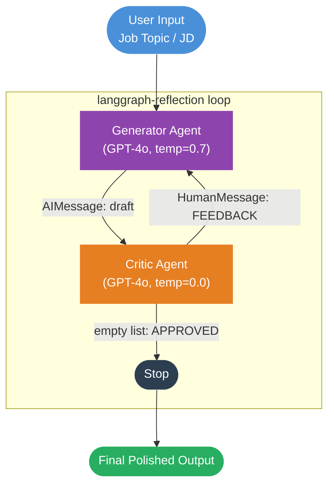
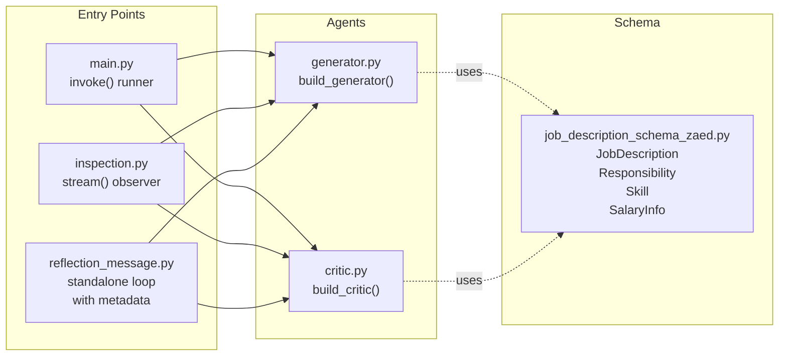
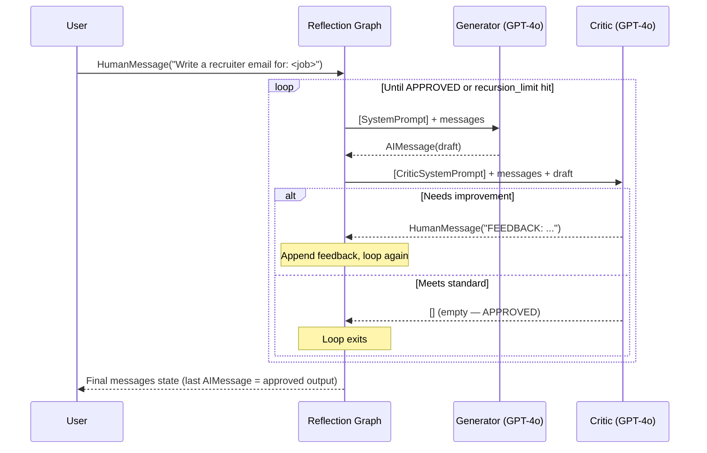
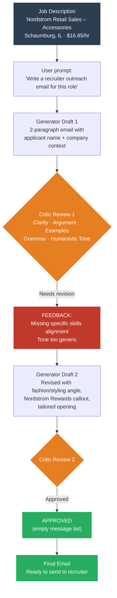

# Job Application Reflection Agent

An AI system that uses a **generator-critic reflection loop** to iteratively refine job application content — recruiter outreach emails and interview preparation — until it meets a high quality standard.

Built with [LangGraph](https://github.com/langchain-ai/langgraph), [langgraph-reflection](https://github.com/langchain-ai/langgraph-reflection), and OpenAI GPT-4o.

---

## How It Works

The agent separates writing from evaluation into two specialized LLM roles that cycle in a loop:

1. **Generator** — writes or revises job application content (recruiter emails, interview guidance) based on a job description and any prior feedback.
2. **Critic** — evaluates the draft against clarity, argument strength, examples, grammar, and humanistic tone. Returns `APPROVED` (empty message list) to stop, or `FEEDBACK:` to trigger another revision.

The loop terminates when the critic approves or a recursion limit is hit.

---

## Architecture



### Module Breakdown



---

## Agent Invocation Sequence



---

## Example Use Case: Sephora Retail Sales Position

This flowchart traces a concrete run against the Nordstrom Retail Sales – Accessories posting in Schaumburg, IL.



---

## Project Structure

```
zaed_job_automation_reflection_agent/
├── .env                          # OPENAI_API_KEY (not committed)
├── requirements.txt
├── concepts.md                   # Deep-dive on the reflection pattern
│
├── main.py                       # invoke() entry point
├── inspection.py                 # stream() entry point for step-by-step observation
├── reflection_message.py         # Standalone loop with recruiter/applicant metadata
│
├── generator.py                  # Generator agent (build_generator)
├── critic.py                     # Critic agent (build_critic)
│
├── job_description_schema.py     # Stub schema (in-progress)
└── job_description_schema_zaed.py # Pydantic models: JobDescription, Responsibility, Skill, SalaryInfo
```

---

## Setup

### Prerequisites

- Python 3.11+
- An OpenAI API key

### 1. Clone and create a virtual environment

```bash
git clone <repo-url>
cd zaed_job_automation_reflection_agent

conda create -n reflection_env python=3.11 -y
conda activate reflection_env
```

### 2. Install dependencies

```bash
pip install -r requirements.txt
pip install langgraph-reflection langchain-openai python-dotenv langgraph
```

### 3. Configure environment variables

```bash
cp .env.example .env
# Edit .env and set:
# OPENAI_API_KEY=sk-...
```

### 4. Run

```bash
# Single invoke run
python main.py

# Streaming step-by-step observer
python -c "from inspection import stream_reflection; stream_reflection('Retail Sales position at Nordstrom')"

# Standalone reflection loop with metadata
python reflection_message.py
```

---

## Next Steps

### Docker

Containerize the agent for reproducible, portable execution.

**Dockerfile (starter)**

```dockerfile
FROM python:3.11-slim

WORKDIR /app

COPY requirements.txt .
RUN pip install --no-cache-dir -r requirements.txt \
    && pip install langgraph-reflection langchain-openai python-dotenv langgraph

COPY . .

ENV PYTHONUNBUFFERED=1

CMD ["python", "main.py"]
```

**Build and run**

```bash
docker build -t reflection-agent .
docker run --env-file .env reflection-agent
```

For iterative development, mount the source directory:

```bash
docker run --env-file .env -v $(pwd):/app reflection-agent
```

A `docker-compose.yml` can add a future PostgreSQL or Redis sidecar for persisting job descriptions, run history, or approved drafts.

---

### Evals

Measure whether the reflection loop actually improves output quality — and catch regressions when prompts change.

**Recommended approach: [LangSmith Datasets + Evaluators](https://docs.smith.langchain.com/evaluation)**

1. **Curate a golden dataset** — collect 10–20 job descriptions with hand-written "ideal" recruiter emails as reference outputs.

2. **Define evaluators** for each critic dimension:

```python
# evals/evaluators.py
from langsmith.evaluation import LangChainStringEvaluator

clarity_evaluator = LangChainStringEvaluator(
    "criteria",
    config={"criteria": "clarity"},
)
tone_evaluator = LangChainStringEvaluator(
    "criteria",
    config={"criteria": "The email sounds human, warm, and not generic"},
)
```

3. **Track cycle count** as an efficiency metric — fewer reflection cycles for the same quality score means better prompts.

4. **Run evals on every prompt change:**

```bash
langsmith eval run --dataset job-application-golden --evaluators clarity tone relevance
```

**Key metrics to track:**

| Metric | Description |
|---|---|
| `approved_on_first_pass` | % of drafts approved without any feedback cycle |
| `avg_reflection_cycles` | Mean cycles before approval (lower = better prompts) |
| `recruiter_response_rate` | Ground truth signal if live emails are tracked |
| `criteria_pass_rate` | Per-dimension scores from LLM-as-judge evaluators |

---

### Observability

Trace every reflection cycle in production to debug, audit, and improve the system.

**LangSmith Tracing (zero-code)**

```bash
# Add to .env
LANGCHAIN_TRACING_V2=true
LANGCHAIN_API_KEY=ls__...
LANGCHAIN_PROJECT=job-reflection-agent
```

With these vars set, every `reflection_graph.invoke()` call automatically emits a full trace — including each generator and critic step, token counts, and latency — to the LangSmith dashboard.

**Structured logging**

Add step-level logging to `inspection.py`'s `stream_reflection` for local observability:

```python
import logging, json

logging.basicConfig(level=logging.INFO, format="%(asctime)s %(message)s")

for step, state in enumerate(reflection_graph.stream(inputs, config={"recursion_limit": 10})):
    for node_name, update in state.items():
        logging.info(json.dumps({
            "step": step,
            "node": node_name,
            "msg_count": len(update.get("messages", [])),
            "approved": not update.get("messages"),
        }))
```

**OpenTelemetry (for production pipelines)**

Use [opentelemetry-instrumentation-langchain](https://github.com/traceloop/openllmetry) to export spans to any OTLP-compatible backend (Datadog, Grafana Tempo, Honeycomb):

```bash
pip install traceloop-sdk
```

```python
from traceloop.sdk import Traceloop
Traceloop.init(app_name="job-reflection-agent")
```

---

## Key Concepts

| Concept | Detail |
|---|---|
| `create_reflection_graph` | Factory from `langgraph-reflection` that wires generator + critic into an automatic loop |
| Termination signal | Critic returns `[]` (empty message list) to approve; any messages trigger another revision |
| Shared message state | Both agents see the full conversation history — original prompt, all drafts, all feedback |
| Temperature split | Generator uses `temp=0.7` for creativity; Critic uses `temp=0` for consistent judgment |
| `recursion_limit` | Hard cap on loop iterations (default: 10 ≈ 3–4 full cycles) |
| Metadata injection | `reflection_message.py` supports runtime replacement of `[Recruiter's Name]`, `[Company Name]`, etc. |

---

## Resources

- [langgraph-reflection on PyPI](https://pypi.org/project/langgraph-reflection/)
- [LangGraph documentation](https://langchain-ai.github.io/langgraph/)
- [LangSmith evaluation docs](https://docs.smith.langchain.com/evaluation)
- [OpenLLMetry (OTel for LLMs)](https://github.com/traceloop/openllmetry)
